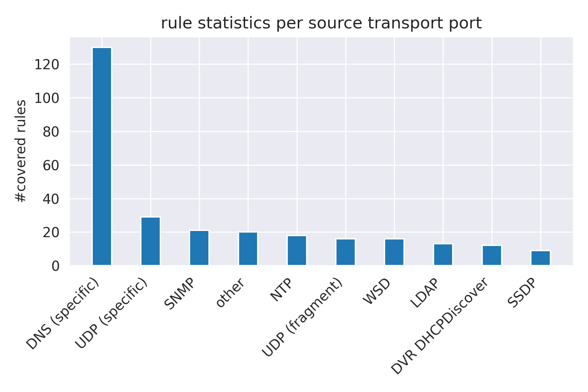
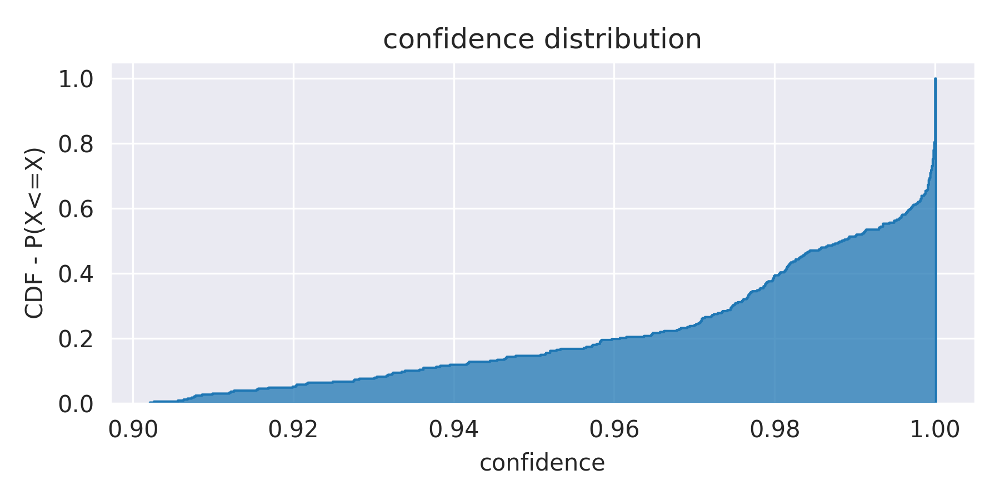

# Countering DDoS Attacks with Comprehensive ACLs learnt from Blackholing Traffic

This repository contains supplemental data for a DE-CIX talk held at the anti-abuse WG meeting at RIP84 Berlin 2022. If you are reading this you are most liked interested in the compiled ACLs (see rules_0.9.json). The JSON format of the ACLs is described hereinafter.

## Contents

* *ddos_acls.pdf* - the talk as held during the WG meeting. The talk motivates the need for a curated list of ACLs containing filters for the most relevant DDoS vectors and show how such a list can be derived from blackholing traffic observable at IXPs.
* *rules_0.9.json* - the list of ACLs in JSON format as described in the presentation. All mined ACLs with a confidence of 90% and higher are contained.

## ACL list JSON format

The ACL list is provided in the following JSON format:

```
"0a42ee90": {                # A unique identifier
 "protocol":17,              # The protocol IANA code
 "port_src":123,             # The L4 transport source port IANA code
 "port_dst":28960,           # The L4 destination port IANA code
 "packet_size":"(400,500]",  # Packet size interval - "(" inclusive border, "]" exclusive border
 "confidence":0.99,          # Probability with which this packet header is blackholed with RTBH [1]
 "antecedent support":1021,  # This rule was mined based on 1021 flows
}
```

Each field can be encoded as a wildcard (`"*"`) carrying a match any semantics.

Notably, protocol, port_src, port_dst, can also be encoded as exclusive sets:

```
"~{0,17,19,21,25,53,69,80,111}"
```

The semantics of this encoding is that none of the above encoded values should be matched. Most vendors do not implement this for ACL matching. It is safe to assume a wildcard instead.

## Rule statistics

The mined rules represent a list of the packet headers most likely to be blackholed at DE-CIX. A lot of the rules cover DNS as DNS is hard to filter as it is frequently used legitimately and constitutes one of the very basic protocols keeping the Internet running. The top 10 covered sending L4 ports are shown below:



A shown below, 80% of the ACLs have a >96% confidence of being blackholed.



## What is missing

A script to convert the JSON format into ACLs for different networking gear (e.g., Cisco, Nokia, etc.). Feel free to issue a pull request if you want to contribute.

## References

[1] T. King, C. Dietzel, J. Snijders et al.: „RFC7999: BLACKHOLE Community“, 2016.

[2] M. Wichtlhuber, A. Rubina, E. Strehle, O. Hohlfeld: "Countering DDoS Attacks with Comprehensive ACLs learnt from Blackholing Traffic", anti abuse WG talk at RIPE84, Berlin, 2022.
